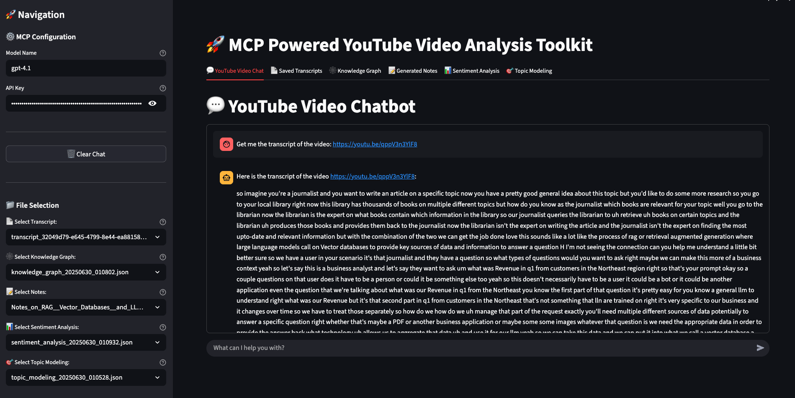
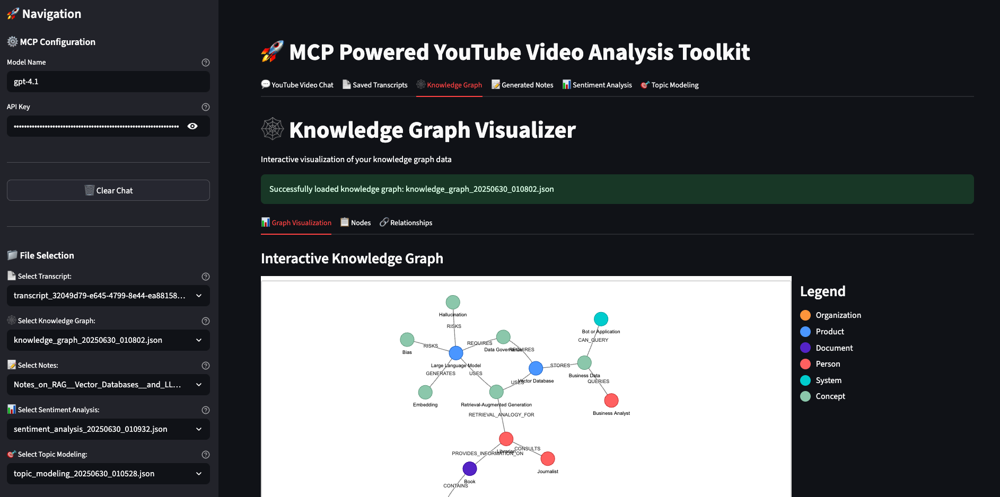
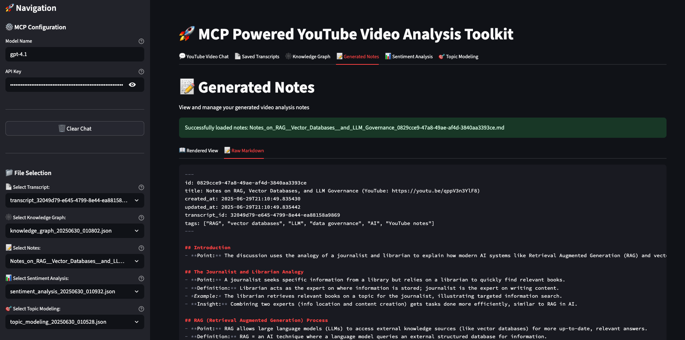
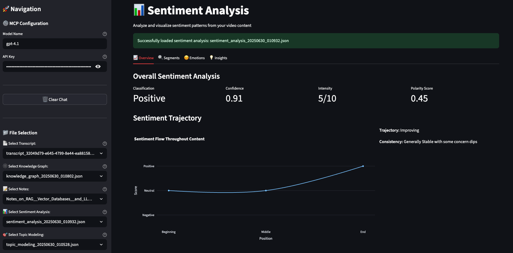
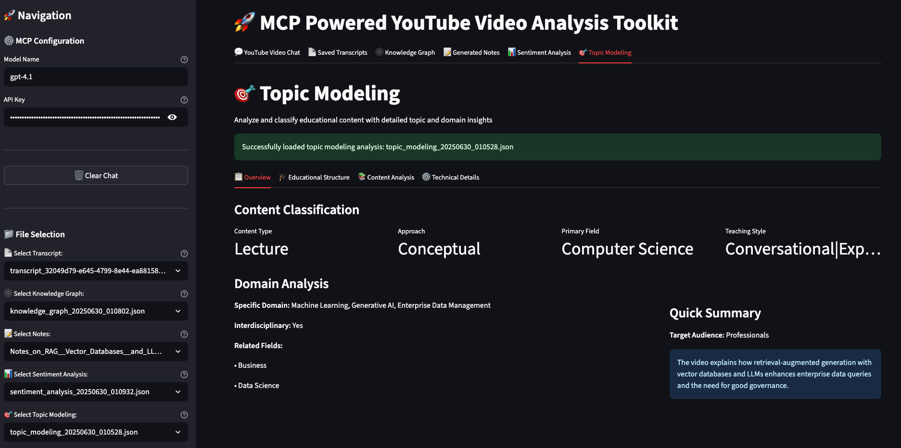

# MCP-Powered YouTube Video Analysis Toolkit

A comprehensive toolkit for analyzing YouTube videos using AI-powered analysis capabilities. This project provides transcript extraction, knowledge graph generation, sentiment analysis, topic modeling, and note generation for educational and research purposes.

## Features

### YouTube Video Analysis - Chat Interface



Interface of MCP Powered YouTube Video Analysis Toolkit.  Extract and analyze transcripts from YouTube videos.

### Knowledge Graph Generation



Interactive knowledge graphs from video content.

### High Quality Note Generation



Automated markdown note generation from transcripts.

### Sentiment Analysis



Comprehensive sentiment analysis with emotional breakdowns.

### Topic Modeling



Content classification and structure analysis.

### MCP Integration: Model Context Protocol for seamless AI agent integration

- Standardized tool access across multiple AI providers
- Multi-server support for distributed analysis capabilities
- Asynchronous streaming for real-time agent interactions

## Architecture

The project consists of two main components:

### Server (`/server`)
- **FastMCP Server**: Built with FastMCP 2.0 framework for Model Context Protocol implementation
  - Automatic tool discovery and async support for high-performance operations
  - Pythonic decorators for simple function-to-tool conversion
  - Built-in authentication and proxying capabilities
  - Comprehensive protocol handling with minimal boilerplate code
- **YouTube Tools**: Video transcript extraction and search capabilities via MCP tools
- **Analysis Tools**: AI-powered prompts exposed as MCP resources for knowledge graphs, sentiment analysis, and topic modeling
- **Data Storage**: Persistent storage management for transcripts, notes, and analysis results

### Client (`/client`)
- **MCP Client Integration**: Built with mcp-use library for seamless MCP server communication
  - Multi-server support enabling connection to multiple MCP servers simultaneously
  - Asynchronous streaming of agent outputs for real-time interactions
  - Dynamic server selection for optimized task execution
  - Configurable via JSON for flexible server management
- **Streamlit Dashboard**: Interactive web interface for visualization
- **Multi-tab Interface**: Separate views for different analysis types
- **Real-time Chat**: MCP-powered chatbot for video analysis using intelligent agents
- **Data Visualization**: Interactive charts and graphs for analysis results

## Project Structure

```
youtube-video-analysis-kit/
├── README.md
├── data/                          # Shared data directory
│   ├── transcripts/              # YouTube video transcripts
│   ├── knowledge_graphs/         # Generated knowledge graphs
│   ├── notes_md/                 # Generated markdown notes
│   ├── sentiment_analysis/       # Sentiment analysis results
│   └── topic_modeling/           # Topic modeling analysis
├── server/                       # Backend MCP server
│   ├── docker-compose.yml
│   ├── Dockerfile
│   ├── main.py                   # Main server application
│   ├── requirements.txt
│   ├── tools/
│   │   ├── prompt_tools.py       # AI analysis prompts
│   │   └── youtube_tools.py      # YouTube integration
│   └── prompts/
│       └── prompts.py           # Prompt templates
├── client/                      # Frontend Streamlit app
│   ├── docker-compose.yml
│   ├── Dockerfile
│   ├── combined_app.py          # Main Streamlit application
│   ├── requirements.txt
│   ├── config/
│   │   └── mcpServers.json      # MCP server configuration
│   └── proxy.py                 # Development proxy
└── screenshots/                 # Documentation screenshots
```

## MCP Integration

### Model Context Protocol (MCP)
This project leverages the Model Context Protocol to provide standardized communication between AI applications and external data sources. MCP enables:

- **Standardized Tool Access**: Consistent interface for AI agents to access various tools and resources
- **Scalable Architecture**: Support for multiple concurrent connections and server instances
- **Protocol Flexibility**: JSON-RPC based communication with support for various transports

### FastMCP Server Implementation
The server component uses FastMCP 2.0, a comprehensive Python framework that:
- Reduces boilerplate code by 90% compared to manual MCP implementation
- Provides automatic tool discovery through Python decorators
- Supports async operations for high-performance data processing
- Includes built-in authentication and server proxying capabilities
- Offers production-ready deployment patterns

### MCP-Use Client Library
The client integrates with mcp-use library to:
- Connect to multiple MCP servers simultaneously
- Enable dynamic server selection based on task requirements
- Provide asynchronous streaming for real-time agent interactions
- Support various LLM providers (OpenAI, Anthropic, Groq)
- Offer flexible configuration management via JSON files

## Getting Started

### Prerequisites

- Docker and Docker Compose
- OpenAI API key
- Python 3.12+ (for local development)

### Clone the repository

```bash
git clone https://github.com/di37/youtube-video-analysis-toolkit.git
cd youtube-video-analysis-toolkit
```

### Docker Deployment

**Server only**:
```bash
cd server
docker-compose up --build
# Server will be available at http://localhost:8000
```

**Client only**:
```bash
cd client
docker-compose up --build
# Client will be available at http://localhost:8501
```

## Usage

### Web Interface

1. **Access the Streamlit dashboard** at `http://localhost:8501`
2. **Configure your OpenAI API key** in the sidebar
3. **Select the appropriate tab** for your analysis needs:
   - **YouTube Video Chat**: Interactive chatbot for video analysis
   - **Saved Transcripts**: View and manage video transcripts
   - **Knowledge Graph**: Visualize entity relationships
   - **Generated Notes**: View markdown notes
   - **Sentiment Analysis**: Emotional and sentiment insights
   - **Topic Modeling**: Educational content analysis

### API Usage

The server exposes MCP tools at `http://localhost:8000`. Available tools include:

- `get_youtube_transcript(url)`: Extract transcript from YouTube video
- `save_transcript(content, source)`: Save transcript data
- `generate_knowledge_graph_prompt()`: Get knowledge graph generation prompt
- `generate_notes_prompt()`: Get note generation prompt
- `generate_sentiment_analysis_prompt(text)`: Get sentiment analysis prompt
- `generate_topic_modeling_prompt(text)`: Get topic modeling prompt
- `save_analysis(analysis_json, analysis_type)`: Save analysis results

### Workflow Example

1. **Analyze a YouTube Video**:
   ```
   Chat: "Please analyze this YouTube video: https://youtube.com/watch?v=..."
   ```

2. **Generate Knowledge Graph**:
   ```
   Chat: "Create a knowledge graph from the latest transcript"
   ```

3. **Perform Sentiment Analysis**:
   ```
   Chat: "Analyze the sentiment of the video content"
   ```

4. **Create Notes**:
   ```
   Chat: "Generate comprehensive notes from the transcript"
   ```

5. **Topic Modeling**:
   ```
   Chat: "Classify the educational content and identify topics"
   ```

## Data Persistence

All analysis results are stored in the `/data` directory:

- **Transcripts**: JSON format with metadata
- **Knowledge Graphs**: Neo4j-compatible JSON structure
- **Notes**: Markdown files with YAML front matter
- **Sentiment Analysis**: Comprehensive JSON analysis
- **Topic Modeling**: Educational content classification

## Configuration

### MCP Server Configuration

Edit `client/config/mcpServers.json` to configure the MCP connection:

```json
{
    "mcpServers": {
        "video-analysis-kit": {
            "url": "http://{your_ip_address}:8000/mcp",
            "transport": "streamable-http"
        }
    }
}
```

Use `ifconfig | grep inet` to find your ip address.

### Docker Configuration

Both services use Docker Compose with volume mounts for data persistence:

- **Server**: Mounts shared data directory and exposes port 8000
- **Client**: Mounts shared data directory and exposes port 8501

## Development

### Adding New Analysis Types

1. **Create prompt template** in `server/prompts/prompts.py`
2. **Add tool function** in `server/main.py`
3. **Update client interface** in `client/combined_app.py`
4. **Add visualization tab** for results display

### Extending the Dashboard

The Streamlit dashboard is modular with separate render functions for each tab:
- `render_chat_tab()`: MCP chatbot interface
- `render_knowledge_graph_tab()`: Interactive graph visualization
- `render_notes_tab()`: Markdown note display
- `render_sentiment_analysis_tab()`: Sentiment visualization
- `render_topic_modeling_tab()`: Educational content analysis

## Troubleshooting

### Common Issues

1. **Port conflicts**: Ensure ports 8000 and 8501 are available
2. **API key errors**: Verify OpenAI API key is correctly set
3. **Volume mount issues**: Check Docker volume permissions
4. **MCP connection errors**: Verify server is running and accessible

### Logs

View container logs:
```bash
docker logs -f <name_of_the_container>
```


## Contributing

1. Fork the repository
2. Create a feature branch
3. Make your changes
4. Add tests if applicable
5. Submit a pull request

## License

This project is licensed under the MIT License - see the LICENSE file for details.

## Acknowledgments

- Built with [FastMCP](https://github.com/jlowin/fastmcp) for MCP server implementation - A comprehensive Python framework for building Model Context Protocol servers with automatic tool discovery, async support, authentication, and production-ready deployment patterns
- Client integration powered by [mcp-use](https://github.com/mcp-use/mcp-use) - Open-source library for connecting any LLM to any MCP server with multi-server support, asynchronous streaming, and flexible agent configuration
- Uses [Streamlit](https://streamlit.io/) for web interface
- Powered by [OpenAI GPT models](https://openai.com/) for AI analysis